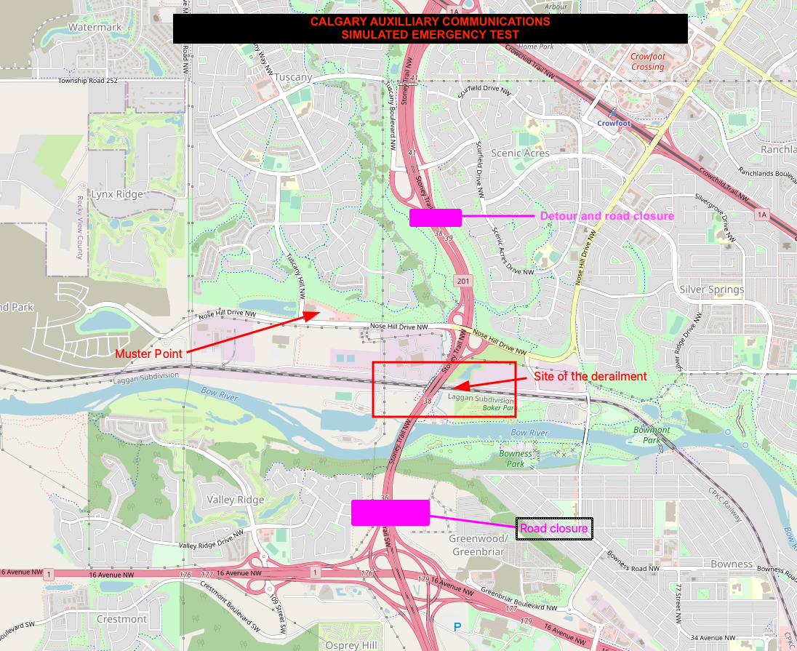

# Simulated Emergency Scenarios for Amateur Radio

This is a Simulated Emergency Test that enables an AuxComm team to test, practice and validate procedures and technical capabitilies. The information here is to be used in a simulation and does not depics a true event.

The objective of this simulated emergency test is to assess the effectiveness of our emergency response systems, including radio communication through Simples, APRS, and Winlink over RF. 

## Simulated Emergency Test Scenario

> ![ATTENTION]
> 
> Please remember to announce **"Exercise Exercise Exercise"** prior to any traffic so that if anyone is listening they don't believe this is a real emergency.

|Scenario | Details
| - | -
| Train Derailment in Calgary. | A train has derailed under the Sarcee Trail overpass in Calgary, resulting in a toxic spill and fire. The area is effectively closed to traffic, causing significant disruption and potential danger to the local population.

## Technical Quick-reference

| Mode | Notes
| - | -
| Voice | Simplex on **146.580MHz** at 9am MST
| Digital | Winlink over RF. Copy Net-Control and Tactical callsign **AUXC-YYC** 
| APRS | Simulated over RF only. Do not send updates over APRS-IS
 
## Scenario Details



At 10:00 AM, a freight train carrying hazardous materials derails under the Sarcee Trail overpass. The derailment causes a toxic spill and a fire, which quickly spreads due to the flammable nature of the materials. The area is immediately closed to traffic, and a safety perimeter is established.

The Calgary Auxilliary Communications Service (ACS) was called by the municipality to assist with relaying information about the situation affecting the evacuees from around the area, offloading this non-essential traffic from first responders. 
  
## Emergency Response

### Voice
The first challenge is to establish a voice net for communication among emergency responders.

PROCEDURE: 

1. We will meet on **Simplex 146.580MHz at 9am MST**.  

### Winlink
Winlink is a powerfull tool and can be used during the exercise to ensure seamless communication with external agencies and the public.

PROCEDURE: 

1. Emails over Winlink should be send to tactical call sign **AUX-YYC** with copies to Net-Control.
1. On Winlink, there are few options with the official forms. We suggest the use of the **Winlink Check-in** or the **ICS213 General Message**. 

### APRS

> ![ATTENTION]
> 
> BEFORE YOU PROCEED: Make sure any updates to APRS are not going over the Internet via APRS-IS (e.g.: No updates on aprs.fi as this might cause confusion with anyone not participating in the exercise). All updates should be only over RF and they should be removed after the exercise is done.

An APRS station can be used to mark the exact location of the train derailment on the map. This information is sent out **only over RF**, allowing anyone with an APRS radio to receive the data and get the exact coordinates.

Any objects in the map should have the comment that reflects that this is an exercise and not a real issue. Please coordinate with Net-Control. Here is an example:

```bash
EXERCISE :: Train Derail
```

**For this exercise there is no real need to drive to the location, this is just to simulate our capability.**


## Check-ins and Position Reports
The voice net is used to take check-ins from various stations, which are then marked on the map. This allows the EOC to have a visual representation of who can hear who, facilitating effective communication in case the repeater fails. 

Operators are also welcome to do a **Position Report** over APRS-IS or RF. Please add some information to your check-in such as these ones:

Details on your setup
```bash
Check in with EOC :: Running on batteries
```

Details on your location

```bash
Check in with EOC :: Weather here is 7C.
```

## Conclusion and After Action Report
This simulated emergency test is designed to challenge our emergency response systems and provide valuable insights into their effectiveness. The lessons learned from this simulation will be invaluable in preparing for real-life emergencies.

An After Action Report (AAR) will be conducted and shared with the team after the event is done to evaluate our capabilities and what can be improved in the future.